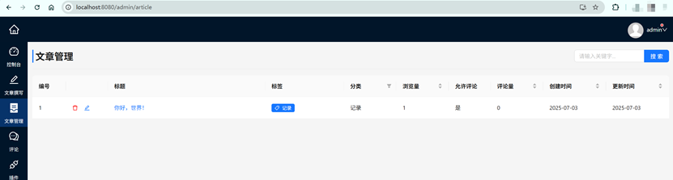
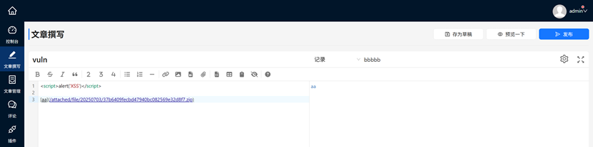
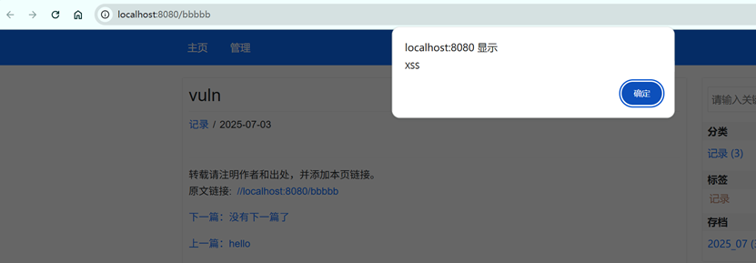

# Zrlog v3.1.6 Stored Cross-Site Scripting (XSS)

## Affected Version

Zrlog v3.1.6

## Vulnerability Description

A Cross-site scripting (XSS) vulnerability exists in the Zrlog admin panel’s article‑editing interface (the /admin/article-edit endpoint), an attacker can bypass the existing <script>-tag filtering by uploading a specially crafted attachment. This allows malicious script content to be stored and later executed whenever a user views the published article, resulting in a stored XSS vulnerability.

## Vulnerability Detail

The following is the article editing page.

By adding <script>-tag and attachments, click the “Publish” button.

When a user visits that page, they will be subjected to an XSS attack.

